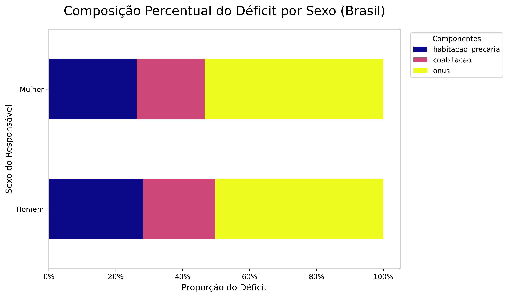
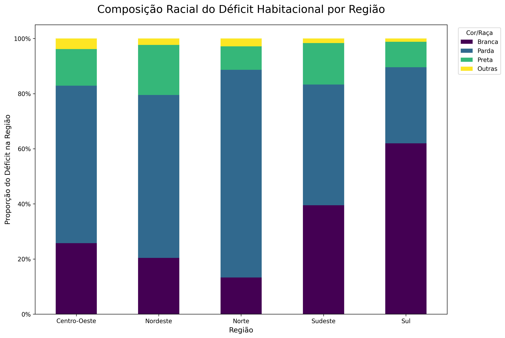

# Análise do Déficit Habitacional no Brasil 🏘️

*Uma análise de dados públicos que revela as múltiplas faces da desigualdade (gênero, raça e renda) por trás da falta de moradia no país.*

Este projeto tem como objetivo analisar dados públicos relacionados ao déficit habitacional nas regiões brasileiras, utilizando Python e bibliotecas de ciência de dados.

## 🎯 Contexto do Projeto

O déficit habitacional é um dos desafios sociais mais complexos do Brasil. Este projeto utiliza dados públicos da Fundação João Pinheiro (FJP) para investigar as dimensões deste problema, focando não apenas nos números totais, mas principalmente em como ele se manifesta de forma diferente entre recortes de **região, renda, gênero e cor/raça**. O objetivo é transformar dados brutos em uma narrativa visual que exponha as estruturas da desigualdade habitacional no país.

## 🚀 Principais Descobertas (Key Findings)

A análise revelou padrões claros e impactantes:

1.  💰 **O Problema é a Baixa Renda:** Quase 80% de todo o déficit habitacional do Brasil está concentrado na população de baixíssima renda (Faixa 1), tornando-o um problema fundamentalmente de pobreza.

2.  👩🏾 **As Múltiplas Faces da Desigualdade:** O déficit afeta desproporcionalmente domicílios chefiados por **mulheres** e pela população **negra (preta e parda)**. A análise regional mostra como a "cor" do déficit muda drasticamente pelo país.

3.  🤔 **As Causas são Diferentes:** A *razão* do déficit não é a mesma para todos. Para mulheres, o **ônus excessivo com aluguel** é o principal motor do problema. Para a população negra, a **precariedade física da moradia** tem um peso maior, indicando que as soluções precisam ser multifacetadas e direcionadas.

## 📊 Visualizações em Destaque

**Composição do Déficit por Causa e Sexo**

*Este gráfico mostra como o 'Ônus com Aluguel' é o principal componente para mulheres, enquanto outros fatores são mais distribuídos para os homens.*



---

**Composição Racial do Déficit por Região**

*A análise regional revela como a "face" do déficit muda, sendo majoritariamente parda no Nordeste e branca no Sul, refletindo demografia e desigualdade.*



## 🛠️ Tecnologias
- Python, pandas, matplotlib, seaborn
- Jupyter Notebook
- Dados públicos da FJP

## 📁 Estrutura
- `data/`: Bases originais e tratadas
- `notebooks/`: Etapas do projeto em Jupyter
- `src/`: Scripts reutilizáveis de limpeza e visualização
- `reports/`: Resultados finais (Excel, gráficos, etc.)

## 🚀 Como Executar a Análise

Para replicar esta análise, siga os passos abaixo:

1.  **Clone o repositório:**
    ```bash
    git clone [https://github.com/Matheus-Andrade-30/municipal-housing-data.git](https://github.com/Matheus-Andrade-30/municipal-housing-data.git)
    cd municipal-housing-data
    ```

2.  **Crie e ative um ambiente virtual:**
    ```bash
    python -m venv venv
    source venv/bin/activate  # No Windows: venv\Scripts\activate
    ```

3.  **Instale as dependências:**
    ```bash
    pip install -r requirements.txt
    ```
    *(Nota: Certifique-se de criar um arquivo `requirements.txt` com o comando `pip freeze > requirements.txt`)*

4.  **Execute os notebooks:**
    Abra os notebooks localizados na pasta `/notebooks/` utilizando o Jupyter Notebook ou Jupyter Lab.